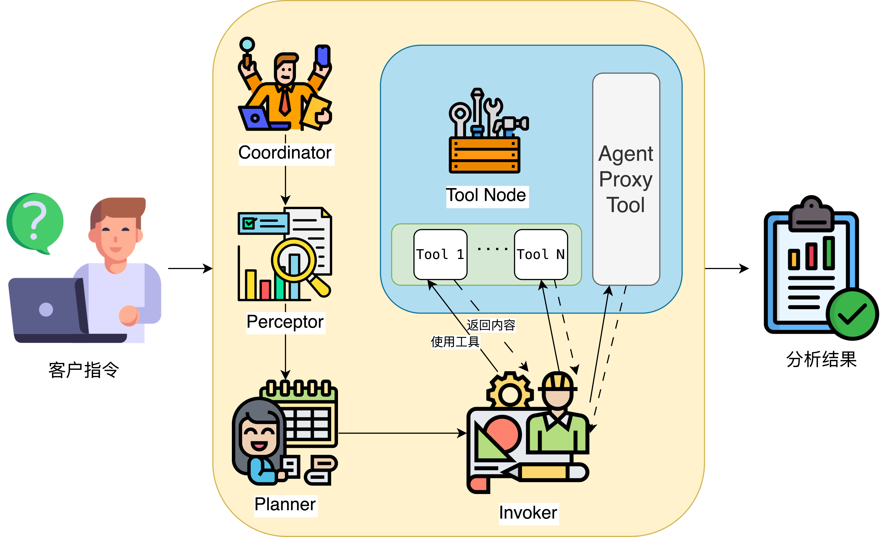

# DataPilot

DataPilot 是一个面向金融等多个领域，进行数据分析和知识管理的智能代理系统。支持自动化数据表、工具、知识库的注册、管理和查询，集成了知识图谱、社区报告、脚本关系抽取等多种功能，适用于企业级数据治理和智能分析场景。

## 主要特性

- **知识库管理**：支持 Markdown 文档分块、嵌入、检索，自动构建知识图谱。
- **元数据管理**：自动注册数据表，抽取列描述、数据类型、可连接关系，支持 MySQL、本地 CSV。
- **工具管理**：自动注册工具，抽取工具与数据表/列/文件的输入输出关系。
- **可视化**：支持知识图谱和元数据关系的 HTML 可视化。

## 快速开始

### **环境配置**

``` 
a2a==0.44
a2a-sdk
ddgs==9.5.4
elasticsearch==9.1.0
fastapi==0.116.1
httpx==0.28.1
langchain==0.3.27
langchain_community==0.3.29
langchain_core==0.3.75
langchain_mcp_adapters==0.1.9
langchain_openai==0.3.32
langgraph==0.6.6
leidenalg==0.10.2
loguru==0.7.3
numpy==2.3.2
openai==1.102.0
pandas==2.3.2
pydantic==2.11.7
python_igraph==0.11.9
pyvis==0.3.2
PyYAML==6.0.2
PyYAML==6.0.2
scikit_learn==1.7.1
SQLAlchemy==2.0.43
tavily_python==0.7.11
urllib3==2.5.0
uvicorn==0.35.0
pymysql
langchain-deepseek
```

### **运行主流程**

推荐使用如下命令启动（入口为 [`datapilot/workflow.py`](datapilot/workflow.py)）：

``` bash
# PROJECT_ROOT为项目所在路径
cd $PROJCET_ROOT
export PATHPATH=$PROJECT_ROOT/datapilot
python -m datapilot.workflow
```

### **用户指令**

在 `workflow.py` 文件，在 `__main__` 部分修改 `user_query` 即可对DataPilot下达指令

``` python
if __name__ == "__main__":
    user_query = "请输入您的分析任务"
    # 示例1：数据分析任务
    # user_query = "分析一下各个区域的消费水平，并生成一份报告。所有需要保存的文件都放在 /data1/agent/machengyuan/intermediate_res3 路径下"
    
    # 示例2：菜谱搜索任务
    # user_query = "帮我搜索一下番茄炒鸡蛋怎么做"
    asyncio.run(run_agent_workflow(user_query))
```


## 整体流程



DataPilot整体框架如图所示，由Coordinator、Perceptor、Planner以及Invoker等关键节点实现对用户需求的分析。节点之间的流转控制由**Router**进行控制，并将在后续实现多轮反思与反馈的功能，从而优化分析结果。

1. **Coordinator**：接收用户需求，分析并分发任务。
2. **Perceptor**：感知可用数据和工具，补充上下文。
3. **Planner**：根据感知模块制定具体任务计划。
4. **Invoker**： 执行计划，调用工具，收集结果。

## 代码架构设计
这个项目采用了分层的抽象架构，将业务逻辑与具体工作流框架实现分离，核心在于支持多种工作流框架并保持良好的可扩展性。

其**优势**在于：

- 🔄 **框架切换成本低**：只需修改配置即可切换框架
- 📈 **易于扩展**：添加新框架时保持相同接口
- 🎯 **业务逻辑复用**：核心逻辑不因框架变化而改变

### 核心抽象基础框架

#### BaseNode & 各角色节点
包括Coodinator、Perceptor等节点在内都所有角色节点都继承`BaseNode`进行实现。优势在于：

- **框架无关性**：业务逻辑不依赖具体LangGraph实现
- **统一接口**：所有节点遵循相同`process`方法签名
- **可扩展性**：未来可轻松切换到其他工作流框架

``` python
class BaseNode(ABC):
    """基础节点抽象类"""

    def __init__(self, node_name: str):
        self.node_name = node_name
        self.logger = logger

    @abstractmethod
    def process(self, state: BaseState) -> BaseState:
        """处理状态并返回更新后的状态"""
        pass
```

**LangGraphCoordinator**

- **职责**：实现**Coordinator**模块作为智能体的“大脑”，负责接收用户需求，分析当前工作流状态，并且可以进行反思（reflect）。
- **核心方法**：
    - `reflect(state: BaseState)`: 反思当前状态，分析需求与上下文。

**LangGraphPerceptor**

- **职责**：负责“感知”当前可用的数据和工具，可从数据库、知识库、工具服务（如 MCP 服务、函数等）等内容中检索相关可用信息。
- **核心方法**：
    - `search_knowledge(query: str)`: 检索知识库，获取背景知识。
    - `search_database(query: str, knowledge: str)`: 检索数据库和工具，获取可用数据。
    - `get_mcp_tools()`:获取可用MCP服务
    - `get_available_tools()`: 获取当前可用工具列表。

**LangGraphPlanner**

- **职责**：根据协调器和感知器提供的信息，制定具体的任务执行计划，并且并对计划进行可行性验证。
- **核心方法**：
    - `generate_plan(state: BaseState)`: 生成任务执行计划。
    - `validate_plan(plan: str, state: BaseState)`: 验证计划的合理性。

**LangGraphInvoker**

- **职责**：负责进行工具调用并对结果进行收集。后续可扩展为支持反思和用户反馈。
- **核心方法**：
    - `generate_tool_calls(state: BaseState)`: 生成工具调用列表。
    - `execute_tool_calls(tool_calls: List[Dict])`: 执行工具调用，返回结果。


**LangGraphRouter**

- **职责**：负责对整个工作节点的流转进行调度。


#### BaseWorkflow 基础工作流
工作流也继承基础工作流`BaseWorkflow`实现
优势在于：

- **完整性验证**：确保工作流配置的完整性
- **统一管理**：集中管理所有节点和路由器
- **框架抽象**：隐藏具体框架的构建细节

``` python
class BaseWorkflow(ABC):
    """基础工作流类"""

    def __init__(self):
        self.coordinator: Optional[BaseCoordinator] = None
        self.perceptor: Optional[BasePerceptor] = None
        self.planner: Optional[BasePlanner] = None
        self.invoker: Optional[BaseInvoker] = None
        self.router: Optional[BaseRouter] = None
        # ...

    def validate_setup(self) -> bool:
        """验证工作流设置是否完整"""
        required_nodes = ["coordinator", "perceptor", "planner", "invoker"]
        for node_name in required_nodes:
            if node_name not in self.nodes:
                self.logger.error(f"Missing required node: {node_name}")
                return False
        return True
```


###  NodeFactory工厂模式


#### 抽象工厂

``` python
class NodeFactory:
    """节点工厂"""

    @staticmethod
    def create_coordinator(coordinator_class: type, **kwargs) -> BaseCoordinator:
        return coordinator_class(**kwargs)
```

#### 具体实现工厂

``` python
class LangGraphNodeFactory:
    """LangGraph节点工厂"""

    @staticmethod
    def create_coordinator(llm_config: Dict[str, Any]) -> LangGraphCoordinator:
        return LangGraphCoordinator(llm_config)
```


## 框架优势

由于框架中的抽象层，团队在实现各个模块时可以有效地进行分工实现，不同团队可以专注于对应节点的实现，并且便于在上线前进行单元测试。虽然抽象层以及构造器的实现增加了代码复杂度，有一定的**短期成本**。但是降低了框架迁移、功能拓展的成本，可以为框架后续提高、迭代提高效率，有着**长远收益**。